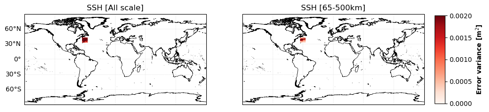

## :warning: WORK in progress. This data-challenge is under construction


<p align="center">
  
</p>

# SSH Mapping Data Challenge 2023a

This repository contains codes and sample notebooks for downloading and processing the 2023a SSH mapping data challenge.
Note that this data challenge is a somewhat extended version of the data challenge [2021a_SSH_mapping_OSE](https://github.com/ocean-data-challenges/2021a_SSH_mapping_OSE) on a global scale.

# 1. Context & Motivation

The Copernicus Marine Service (CMEMS) is committed to providing high-quality, state-of-the-art ocean products through the validation and verification of physical oceanic parameters on both global and regional scales. Among the variables distributed by the service, ocean surface topography and surface currents are of great interest to the oceanographic communities for practical applications and for scientific research.

Several mapping techniques, such as statistical interpolation methods or ocean model assimilation methods, are currently proposed to provide operational maps of ocean surface heights and currents. New mapping techniques (e.g. data-driven methods) are emerging and being tested in a research and development context. 
It is therefore becoming important to inform users and developers about the accuracy of scale represented by each mapping system.


<p align="center">
  
</p>
 

The goal of the present data-challenge is to investigate how to best reconstruct sequences of Sea Surface Height (SSH) and surface current maps from partial satellite altimetry observations and from a global perspective. This data challenge follows an _Observation System Experiment_ framework: Satellite observations are from real sea surface height data from altimeter. The practical goal of the challenge is to investigate the best mapping method according to scores described below and in Jupyter notebooks.

### Observations

The SSH observations used in this study comprise data from a nadir altimeter constellation that includes Jason 3, Sentinel 3A, Sentinel 3B, Haiyang-2A, Haiyang-2B, and Cryosat-2. These data are distributed by the Copernicus Marine Service [(https://doi.org/10.48670/moi-00146)](https://doi.org/10.48670/moi-00146) and cover the period from January 1st, 2019 to December 31st, 2019. The Saral/AltiKa altimeter data are excluded from the mapping process to enable an independent assessment of the different reconstructions.

In addition, independent assessment of ocean surface currents is performed using in situ data, which are also distributed by CMEMS [(https://doi.org/10.17882/86236)]( https://doi.org/10.17882/86236).


### Data sequence and use
 
The SSH reconstructions are assessed at global scale and over the period from 2019-01-01 to 2019-12-31.

For reconstruction methods that need a spin-up, the **observations** from other period can be used.

The altimeter data from Saral/AltiKa and surface current velocity data mentioned above should never be used so that any reconstruction can be considered uncorrelated to the evaluation period.


# 2. Get started


## Installation
:computer: _**How to get started ?**_

Clone the data challenge repo: 
```
git clone https://github.com/ocean-data-challenges/2023a_SSH_mapping_OSE.git
```
or using SSH: 
```
git clone git@github.com:ocean-data-challenges/2023a_SSH_mapping_OSE.git
```

create the data challenge conda environment, named env-dc-swot-filtering, by running the following command:
```
conda env create --file=dc_environment.yml 
```
and activate it with:

```
conda activate env-dc-global-ose
```
then add it to the available kernels for jupyter to see: 
```
ipython kernel install --name "env-dc-global-ose" --user
```

You're now good to go ! 


## Download the data
:building_construction: TO DO: Add example on how to download/read data from MEOM server

## Evaluation

The mapping methods are evaluated against independent data using two approaches:Firstly, the ocean surface topography reconstruction is compared with indepen dent data from Saral/AltiKa altimeter. Secondly, the surface currents are assessed by comparing them to the surface drifter velocities.
 

## Data processing

Cross-functional modules are gathered in the `src` directory. They include tools for regridding, plots, evaluation, writing and reading NetCDF files.   


# 3. Global evaluation 

## Leaderboard

:building_construction: TO DO: stat by ocean regime

### SSH evaluation with independant nadir


| Ocean regime          | Methods  |   Err variance score (All scales) |   Err variance score (65-500km) | 
|:---------------------:|----------|:---------------------------------:|:-------------------------------:| 
|                       | DUACS    |        0.683678                   |         0.682788                | 
| **Coastal**           | MIOST    |        0.689822                   |         0.697257                | 
|                       | MIOST EW |        **0.693327**               |         **0.697649**            | 
| | | | |  
|                       | DUACS    |        0.941316                   |         0.941316                | 
| **Offshore high var** | MIOST    |        0.945153                   |         **0.956015**            | 
|                       | MIOST EW |        **0.945677**               |         0.955963                | 
| | | | |  
|                       | DUACS    |        0.800111                   |         0.868348                | 
| **Offshore low var**  | MIOST    |        0.806072                   |         0.873085                |  
|                       | MIOST EW |        **0.812999**               |         **0.873896**            | 
| | | | |  
|                       | DUACS    |        0.764560                   |         0.415881                | 
| **Equatorial band**   | MIOST    |        0.757493                   |         0.423876                | 
|                       | MIOST EW |        **0.765894**               |         **0.426543**            |  
| | | | |  
|                       | DUACS    |        **0.667031**               |         0.585653                |  
| **Arctic**            | MIOST    |        0.650382                   |         0.594350                | 
|                       | MIOST EW |        0.658796                   |         **0.600981**            |  
| | | | |  
|                       | DUACS    |        0.415025                   |         0.077469                |  
| **Antarctic**         | MIOST    |        0.429089                   |       **0.103416**              | 
|                       | MIOST EW |        **0.458979**               |         0.096746                | 
 


### Currents evaluation with drifters


## Detailed evaluation


|   | Error variance |
| ------ | -------------- |
| DUACS |<p align="center"></p> |
| MIOST |<p align="center"></p> |
| MIOST w/ EW |<p align="center"></p> |


...

[See a more detailed evaluation here](detailed_eval_glob.md)

# 4. Gulf stream evaluation 

## Leaderboard

:building_construction: TO DO: stat by ocean regime


## Qualitative evaluation


# Acknowledgement


<!---


[](https://doi.org/10.5281/zenodo.5511905)

# SSH Mapping Data Challenge 2021a

This repository contains codes and sample notebooks for downloading and processing the SSH mapping data challenge.

The quickstart can be run online by clicking here:
[](https://binder.pangeo.io/v2/gh/ocean-data-challenges/2020a_SSH_mapping_NATL60/master?filepath=quickstart.ipynb)

## Motivation

The goal is to investigate how to best reconstruct sequences of Sea Surface Height (SSH) maps from partial satellite altimetry observations. This data challenge follows an _Observation System Experiment_ framework: Satellite observations are from real sea surface height data from altimeter. The practical goal of the challenge is to investigate the best mapping method according to scores described below and in Jupyter notebooks.

### Observations
The SSH observations include SARAL/Altika, Jason 2, Jason 3, Sentinel 3A, Haiyang-2A and Cryosat-2 altimeter data. This nadir altimeters constellation was operating during the 20170101-20171231 period. Note that for the mapping the Cryosat-2 altimeter data are not taken in the mapping to perfor the independent assessment of the various reconstructions. 

### Data sequence and use
 
The SSH reconstructions are assessed over the period from 2017-01-01 to 2017-12-31.

For reconstruction methods that need a spin-up, the **observations** can be used from 2016-12-01 until the beginning of the evaluation period (31 days). This spin-up period is not included in the evaluation. For reconstruction methods that need learning from full fields, the **baseline reconstruction** or **duacs reconstrcution** can be used from 2017-01-01 to 2017-12-31. The altimeter data from Cryosat-2  should never be used so that any reconstruction can be considered uncorrelated to the evaluation period.


## Leaderboard

| Method   |   µ(RMSE)  |   σ(RMSE) |   λx (km) | Notes             | Reference                |
|:---------|-----------:|----------:|----------:|:------------------|:-------------------------|
| BASELINE |    0.85 | 0.09 |       140 | Covariances BASELINE OI | [example_eval_baseline.ipynb](https://github.com/ocean-data-challenges/2021a_SSH_mapping_OSE/blob/master/notebooks/example_eval_baseline.ipynb) |
| DUACS    |    0.88 | 0.07 |       152 | Covariances DUACS DT2018 | [example_eval_duacs.ipynb](https://github.com/ocean-data-challenges/2021a_SSH_mapping_OSE/blob/master/notebooks/example_eval_duacs.ipynb) |
| MIOST    |   0.89 | 0.08 |       139 | Multiscale mapping | [example_eval_miost.ipynb](https://github.com/ocean-data-challenges/2021a_SSH_mapping_OSE/blob/master/notebooks/example_eval_miost.ipynb) |
| DYMOST   |   0.89 | 0.06 |       129 | Dynamic mapping | [example_eval_dymost.ipynb](https://github.com/ocean-data-challenges/2021a_SSH_mapping_OSE/blob/master/notebooks/example_eval_dymost.ipynb) |
| BNF      |   0.88 | 0.06 |       122 | BFN mapping | [example_eval_bfn.ipynb](https://github.com/ocean-data-challenges/2021a_SSH_mapping_OSE/blob/master/notebooks/example_eval_bfn.ipynb) |
| 4DVarNet (v2021) |   **0.89** |  **0.06** |       122 | 4DVarNet mapping | [example_eval_4DVarnet.ipynb](https://github.com/ocean-data-challenges/2021a_SSH_mapping_OSE/blob/master/notebooks/example_eval_4dvarnet.ipynb) |
| 4DVarNet (v2022) |   **0.89** | 0.09 |       **109** | 4DVarNet mapping | [example_eval_4DVarnet_v2022.ipynb](https://github.com/ocean-data-challenges/2021a_SSH_mapping_OSE/blob/master/notebooks/example_eval_4dvarnet_v2022.ipynb) |


**µ(RMSE)**: average RMSE score.  
**σ(RMSE)**: standard deviation of the RMSE score.  
**λx**: minimum spatial scale resolved.   
 
## Quick start
You can follow the quickstart guide in [this notebook](https://github.com/ocean-data-challenges/2020a_SSH_mapping_NATL60/blob/master/quickstart.ipynb) or launch it directly from <a href="https://binder.pangeo.io/v2/gh/ocean-data-challenges/2020a_SSH_mapping_NATL60/master?filepath=quickstart.ipynb" target="_blank">binder</a>.

## Download the data
The data are hosted on the [AVISO+ website](https://www.aviso.altimetry.fr/en/data/products/ocean-data-challenges/2021a-ssh-mapping-ose.html) and tagged with DOI: 10.24400/527896/a01-2021.005. The website also provides a data handbook. This is the recommended access. This [wiki](https://github.com/ocean-data-challenges/2020a_SSH_mapping_NATL60/wiki/AVISO---account-creation) can help you create an AVISO account to access the data. The data are also temporarily available [here](https://ige-meom-opendap.univ-grenoble-alpes.fr/thredds/catalog/meomopendap/extract/ocean-data-challenges/dc_data1/catalog.html). They are presented with the following directory structure:

```
. 
|-- dc_obs
|   |-- dt_global_alg_phy_l3_20161201-20180131_285-315_23-53.nc
|   |-- dt_global_c2_phy_l3_20161201-20180131_285-315_23-53.nc 
|   |-- dt_global_h2g_phy_l3_20161201-20180131_285-315_23-53.nc
|   |-- dt_global_j2g_phy_l3_20161201-20180131_285-315_23-53.nc
|   |-- dt_global_j2n_phy_l3_20161201-20180131_285-315_23-53.nc
|   |-- dt_global_j3_phy_l3_20161201-20180131_285-315_23-53.nc
|   |-- dt_global_s3a_phy_l3_20161201-20180131_285-315_23-53.nc

|-- dc_maps
|   |-- OSE_ssh_mapping_BASELINE.nc
|   |-- OSE_ssh_mapping_BFN.nc
|   |-- OSE_ssh_mapping_DUACS.nc
|   |-- OSE_ssh_mapping_DYMOST.nc
|   |-- OSE_ssh_mapping_MIOST.nc
|   |-- OSE_ssh_mapping_4dvarNet.nc
|   |-- OSE_ssh_mapping_4dvarNet_2022.nc (NOT on AVISO+ yet !!!!)
|   |-- mdt.nc

```

## Baseline and evaluation

### Baseline
The baseline mapping method is optimal interpolation (OI), in the spirit of the present-day standard for DUACS products provided by AVISO. OI is implemented in the [`baseline_oi`](https://github.com/ocean-data-challenges/2021a_SSH_mapping_OSE/blob/master/notebooks/baseline_oi.ipynb) Jupyter notebook. The SSH reconstructions are saved as a NetCDF file in the `results` directory. The content of this directory is git-ignored.
   
### Evaluation

The evaluation of the mapping methods is based on the comparison of the SSH reconstructions with the *independent* Cryosat-2 along-track dataset. It includes two scores, one based on the Root-Mean-Square Error (RMSE), the other based on Fourier wavenumber spectra. The evaluation notebook [`example_data_eval`](https://github.com/ocean-data-challenges/2020a_SSH_mapping_NATL60/blob/master/notebooks/example_data_eval.ipynb) implements the computation of these two scores as they could appear in the leaderboard. The notebook also provides additional, graphical diagnostics based on RMSE and spectra.

## Data processing

Cross-functional modules are gathered in the `src` directory. They include tools for regridding, plots, evaluation, writing and reading NetCDF files. The directory also contains a module that implements the baseline method.  

## Acknowledgement

The structure of this data challenge was to a large extent inspired by [WeatherBench](https://github.com/pangeo-data/WeatherBench).


--->
