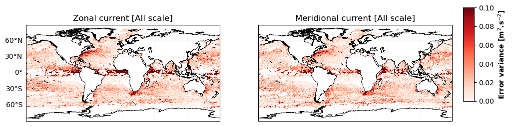

## MIOST detailed global evaluation

### SSH evaluation with independant nadir

#### Statistics

|   | Error variance |
| ------ | -------------- | 
| MIOST |

 | 

|   | Explained variance |
| ------ | -------------- | 
| MIOST |

 | 

#### Spectral

|   | Effective resolution |
| ------ | -------------- | 
| MIOST |

 | 

### U, V evaluation with independant drifters

#### Statistics

|   | Error variance |
| ------ | -------------- | 
| MIOST |

 | 

|   | Explained variance |
| ------ | -------------- | 
| MIOST |

 | 

#### Spectral

|   | Effective resolution |
| ------ | -------------- |
| MIOST |

 | 
