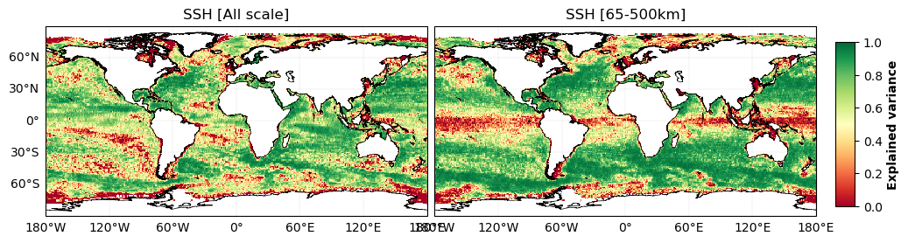
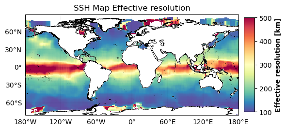
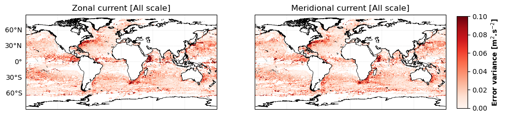
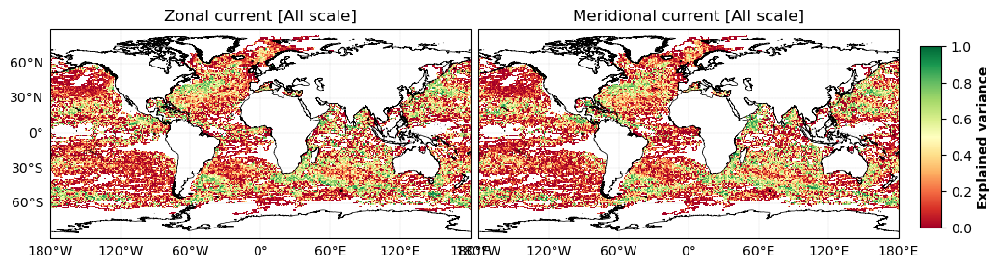
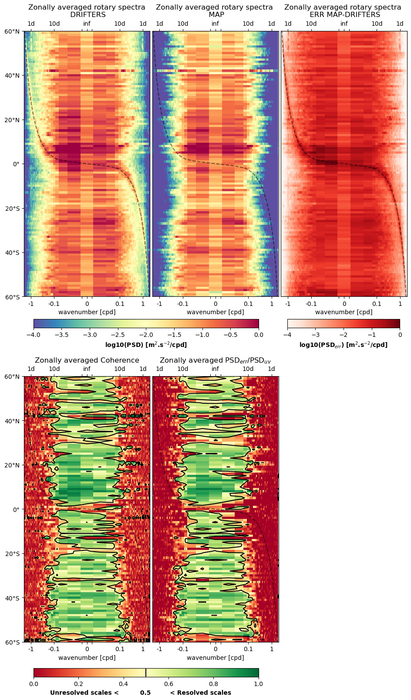

 
   

 Evaluation 

  

  

The mapping methods are evaluated against independent data using two independant datasets:

  
 
 size="6" Independant nadir SSH data 
### [Check example 1](https://github.com/ocean-data-challenges/2023a_SSH_mapping_OSE/blob/main/nb_diags_global/ssh_scores_DUACS_geos.ipynb)

The ocean surface topography reconstruction is compared with independant data from Saral/AltiKa altimeter. The reconstructed maps are first interpolated onto the independant nadir tracks. The following diagnostics are then performed along these tracks and aggregated in 1° longitude x 1° latitude boxes.

The metrics available using this independant nadir dataset are:

- **Grid boxes statistics (maps)**
    The SSH error variance and explained variance are computed in each box and displayed as maps. 
    
| SSH Error variance |  SSH Explained variance |
| ------------ | -------------- |
|   |    | 
    
- **Statistics by regimes (scalar scores)** 
    The corresponding averages are computed in specific geographical areas and regimes (*coastal, offshore-high variability, offshore-low variability, equatorial band, Arctic, Antarctic*) in order to provide a series of scores displayed in the *Leaderboards*.
    
    

| Ocean regime          | Methods  |   Err variance score (All scales) |   Err variance score (65-500km) | 
|:----------------------|----------|:---------------------------------:|:-------------------------------:| 
|   **Coastal**         | DUACS    |        0.683678                   |         0.682788                |  
| | | | |  
| **Offshore high var** | DUACS    |        0.941316                   |         0.941316                |  
| | | | |  
| **Offshore low var**  | DUACS    |        0.800111                   |         0.868348                |  
| | | | |  
| **Equatorial band**   | DUACS    |        0.764560                   |         0.415881                |  
| | | | |  
| **Arctic**            | DUACS    |        **0.667031**               |         0.585653                |   
| | | | |  
| **Antarctic**         | DUACS    |        0.415025                   |         0.077469                |  

    
- **Spectral effective resolution (maps)**

To obtain the spectral effective resolution, the Wavenumber Power Spectra Density (WPSD) is used along track. A noise-to-signal ratio is defined as NSR =1- WPSD(SSH_nadir-SSH_reconstructed)/WPSD(SSH_nadir).
 
For a given wavenumber, a score of 1 indicates a perfect reconstruction (the amplitude and phase of the corresponding harmonic is right) and a score of 0 indicates no phase correlation.

The effective resolution (ER) is finally defined as the lowest scale at which the NSR is equal to 0.5 (Ballarotta et al. 2019). By aggregating in 1° longitude x 1° latitude boxes, the ER values are displayed onto spatial maps. 

| Effective resolution |
| -------------- |
| |

 size="5" Independant drifters  

In this section, the mapping performances are assessed by comparing the currents products (or estimated geostrophic velocities for methods that only reconstruct SSH) with independent drifter data (available at 6-hour resolution). The ageostrophic component of the observed velocities have not been removed in these reference data. 

### Drifter currents [Check example 2](https://github.com/ocean-data-challenges/2023a_SSH_mapping_OSE/blob/main/nb_diags_global/uv_scores_DUACS_geos.ipynb)

Firstly, Eulerian diagnostics are performed by comparing the estimated currents with the velocities measured by the drifters at each location (in space and time) of the drifters. The methodology used is the same as for the SSH evaluation: the mapped velocities (meridional and zonal components) are interpolated on the drifters' locations and the errors with the drifters' velocities are aggregated in 1° longitude x 1° latitude boxes.

The metrics available using this independant dataset are:

- **Grid boxes statistics (maps)**
    Similarly to the SSH evaluation, the error variance and the explained variance are computed in each box. 
    
| Currents Error variance |  Currents Explained variance |
| ------------ | -------------- |
|   |    | 
    
- **Statistics by regimes (scalar scores)**
    Corresponding averages are computed in specific geographical areas and regimes (*coastal, offshore-high variability, offshore-low variability, equatorial band, Arctic, Antarctic*) in order to provide a series of scores displayed in the *Leaderboards*.
    
- **Zonaly averaged rotary spectra (omega-latitude plots)** 
    The frequency rotary spectra of drifter (artificial from reconstruction and real) velocity (Ee) are computed along the drifter trajectories and displayed as a function of latitude and frequency. The velocity spectra are characterized by high-energy peaks at low frequencies (<0.5 cpd), diurnal, semidiurnal, and latitude-varying inertial frequencies. This diagnostics allows to assess the methods' reconstruction skills on certain specific dynamics. For instance, the dashed line superimposed to the spectrum corresponds to the inertial frequency, hence, the energy around that dashed line is characteristic of near-inertial oscillation induced currents. This energy can be observed in the real drifter data but is also partly reconstructed by some methods (e.g., WOC product or Glorys12v1).  
    
| Effective resolution |
| -------------- |
| | 

### Drifter trajectories [Check example 3](https://github.com/ocean-data-challenges/2023a_SSH_mapping_OSE/blob/main/nb_diags_global/uv_scores_DUACS_geos.ipynb)

Secondly, a **Lagrangian diagnostic** is performed by reproducing the real drifter trajectories using the reconstructed currents and comparing the deviation between the real and the reconstructed trajectories. More precisely, the distances between each drifter's location and the expected locations obtained by advecting past positions from the reconstructed velocities are computed. Thise distances are evaluated with forecast lead times ranging from 0 to 5 days, every day.
